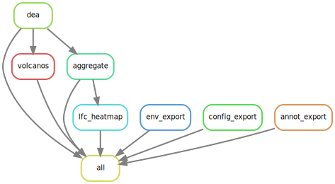

# scRNA-seq Differential Expression Analysis & Visualization using Seurat and Snakemake
A [Snakemake](https://snakemake.readthedocs.io/en/stable/) workflow for performing differential expression analyses (DEA) of sc/snRNA-seq data powered by the R package [Seurat's](https://satijalab.org/seurat/index.html) functions [FindMarkers](https://satijalab.org/seurat/reference/findmarkers) and [FindAllMarkers](https://satijalab.org/seurat/reference/findallmarkers).

Table of contents
-----------------
  * [Test data](#test-data)
  * [Software](#software)
  * [Steps](#steps)
  * [Configuration](#configuration)
  * [Authors](#authors)
  * [Links](#links)

# Test data

We provide a subset of cells from the following human T-Cell dataset as test case for the workflow:

Cano-Gamez, E., Soskic, B., Roumeliotis, T.I. et al. Single-cell transcriptomics identifies an effectorness gradient shaping the response of CD4+ T cells to cytokines. Nat Commun 11, 1801 (2020). https://doi.org/10.1038/s41467-020-15543-y

This work examines the transcriptional patterns of human naïve and memory CD4+ T cells to show that responses to cytokines differ substantially between these cell types. The analysis of the different data modalities is documented in the following repository:
https://github.com/eddiecg/T-cell-effectorness

The folder [test_data](/test_data) contains two sets of files starting with "Memory_Tcells" and "Naive_Tcells". The "counts.rds" files contain a raw count matrix and the "metadata.csv" the corresponding metadata annotation for the cells in the count matrix. Each count matrix and metadata table can be combined into a Seurat object as starting point for the workflow.

# Steps
The workflow perfroms the following steps.
- Differential Expression Analysis (DEA)
  - using Seurat's [FindMarkers](https://satijalab.org/seurat/reference/findmarkers) or [FindAllMarkers](https://satijalab.org/seurat/reference/findallmarkers) depending on the configuration (CSV)
  - feature list per comparison group and direction (up/down) for downstream analysis (eg enrichment analysis) (TXT)
  - (optional) feature score tables (with two columns: "feature" and "score") per comparison group using {score_formula} for downstream analyses (eg preranked enrichment analysis) (CSV).
- DEA result statistics: number of statistically significant results split by positive (up) and negative (down) change (CSV)
- DEA result filtering by 
  - statistical significance (adjusted p-value)
  - effect-size (log 2 fold change)
  - expression (minimum percentage of expression) in one of the comparison groups
- Log Fold Change (LFC) matrix of filtered features by comparison groups (CSV)
- Visualizations
  - all and filtered DEA result statistics: number of features and direction (stacked Bar plots)
  - Volanco plot per comparison with configured cutoffs for statistical significance and effect-size
  - Clustered Heatmaps of the LFC matrix

# Configuration
Detailed specifications can be found here [./config/README.md](./config/README.md)

# Software
This project wouldn't be possible without the following software and their dependencies:

| Software       | Reference (DOI)                                   |
| :------------: | :-----------------------------------------------: |
| EnhancedVolcano| https://doi.org/10.18129/B9.bioc.EnhancedVolcano  |
| ggplot2        | https://ggplot2.tidyverse.org/                    |
| patchwork      | https://CRAN.R-project.org/package=patchwork      |
| pheatmap       | https://cran.r-project.org/package=pheatmap       |
| Seurat         | https://doi.org/10.1016/j.cell.2021.04.048        |
| Snakemake      | https://doi.org/10.12688/f1000research.29032.2    |

# Authors
- adapted from the dea_seurat by [Stephan Reichl](https://github.com/sreichl)

# Links
- [GitHub Repository](https://github.com/roblehmann/dea_seurat/)
- [Snakemake Workflow Catalog Entry](https://snakemake.github.io/snakemake-workflow-catalog?usage=epigen/dea_seurat)

